---

# Overview of the slides

<br>
🌐 An High-Level Overview of Javascript
<br>
<br>

🚀 The JavaScript Engine and Runtime
<br>
<br>

🧠 Execution Contexts and the Call Stack
<br>
<br>

🔗 Scope and The Scope Chain
<br>
<br>

🔄 Variable Environment
<br>
<br>

⚖️ Dynamic vs Static Memory
<br>

<!--
You can have `style` tag in markdown to override the style for the current page.
Learn more: https://sli.dev/features/slide-scope-style
-->

<style>
h1 {
  background-color: #F0C808;
  background-image: linear-gradient(45deg, #F7DF1E 10%, #D4A017 20%);
  background-size: 100%;
  -webkit-background-clip: text;
  -moz-background-clip: text;
  -webkit-text-fill-color: transparent;
  -moz-text-fill-color: transparent;
}
</style>

<!--
Here is another comment.
-->

---


---

<div class="scrollable-container">

|                                                    |                             |
| -------------------------------------------------- | --------------------------- |
| <kbd>High-level </kbd>                | We don't need to manage resources; the JavaScript engine does it automatically. |
| <kbd>Garbage-collected</kbd> | Memory management: an algorithm in the JavaScript engine automatically removes old and unused objects. |
| <kbd>Interpreted or just-in-time compiled</kbd> | Code is compiled at runtime, enabling faster execution. |
| <kbd>Multi-paradigm</kbd>  | Procedural programming, object-oriented programming, functional programming. We can use any paradigm we prefer. |
| <kbd>Prototype-based object-oriented</kbd> | ``` const arr = [1,2,3] ``` ```array.push(4)``` ```->``` ``` Array.prototype.push```|
| <kbd>First-class functions</kbd> | Functions are treated as "variables" and can be passed into or returned from other functions. ```overlay.addEventListener("click", someFunctionName)```|
| <kbd>Dynamic Memory</kbd> | In JavaScript, variables don't have fixed data types. Memory is allocated at runtime, making memory management more flexible and efficient. |
| <kbd>Static Memory</kbd> | Memory size is pre-defined and does not change during the program’s execution. |
| <kbd>Single-threaded</kbd>  | How does the JavaScript engine handle multiple tasks at once? 👉 JavaScript runs on a single thread, so it can only do one thing at a time. |
| <kbd>Non-blocking event loop</kbd>                                    | The ```Event Loop``` is a continuous process that manages code execution by handling the call stack, microtask queue, and callback queue, ensuring efficient and non-blocking execution of asynchronous operations in JavaScript. |

</div>

<style>
.scrollable-container {
  max-height: 400px; /* განუსაზღვრეთ სიმაღლე */
  overflow-y: auto; /* ვერტიკალური სქროლის გააქტიურება */
}

kbd {
  font-size: 10px;
  display: inline-block;
  margin-bottom: 2px;
  margin: 0px;
}

td {
  font-size: 12px; 
  padding: 8.5px;
  margin: 0px;
}

</style>

---


---


---
layout: two-cols
---

```ts 

const name = 'Jonas';

const first = () => {
  let a = 1;
  const b = second(7, 9);
  a = a + b;
  return a;
};

function second(x, y) {
  var c = 2;
  return c;
}

const x = first();
```

::right::

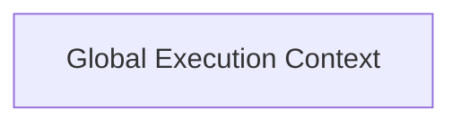

---
layout: two-cols
---

````md magic-move {lines: true}
```ts {1}

const name = 'Jonas';

const first = () => {
  let a = 1;
  const b = second(7, 9);
  a = a + b;
  return a;
};

function second(x, y) {
  var c = 2;
  return c;
}

const x = first();
```
````

::right::

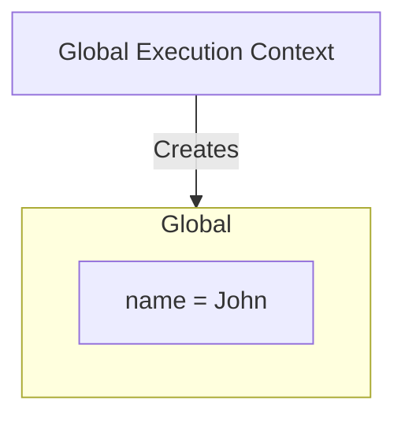

---
layout: two-cols
---

````md magic-move {lines: true}
```ts {3}

const name = 'Jonas';

const first = () => {
  let a = 1;
  const b = second(7, 9);
  a = a + b;
  return a;
};

function second(x, y) {
  var c = 2;
  return c;
}

const x = first();
```
````

::right::

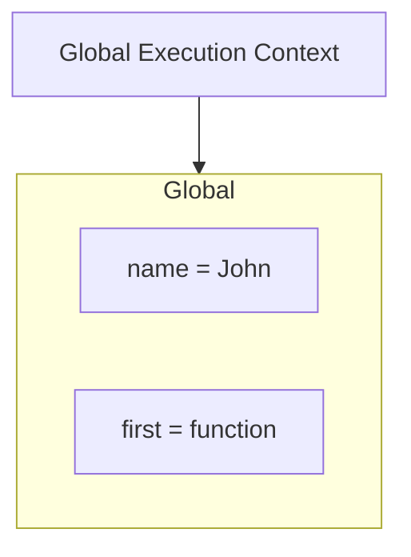

---
layout: two-cols
---

````md magic-move {lines: true}
```ts {10}

const name = 'Jonas';

const first = () => {
  let a = 1;
  const b = second(7, 9);
  a = a + b;
  return a;
};

function second(x, y) {
  var c = 2;
  return c;
}

const x = first();
```
````

::right::

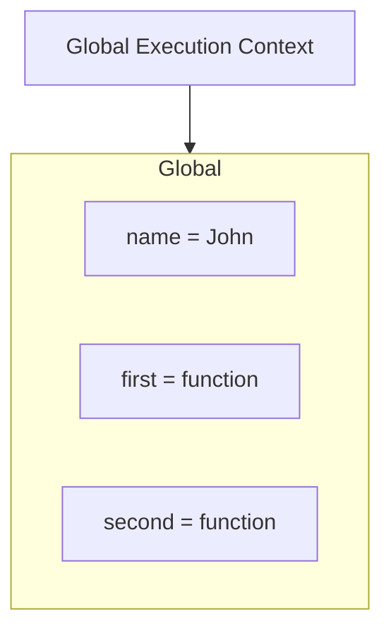

---
layout: two-cols
---

````md magic-move {lines: true}
```ts {15}

const name = 'Jonas';

const first = () => {
  let a = 1;
  const b = second(7, 9);
  a = a + b;
  return a;
};

function second(x, y) {
  var c = 2;
  return c;
}

const x = first();
```
````

::right::

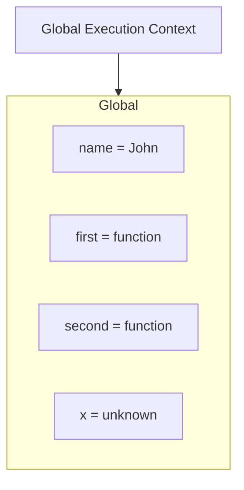

---
layout: two-cols
---

````md magic-move {lines: true}
```ts {4-7}

const name = 'Jonas';

const first = () => {
  let a = 1;
  const b = second(7, 9);
  a = a + b;
  return a;
};

function second(x, y) {
  var c = 2;
  return c;
}

const x = first();
```
````

::right::

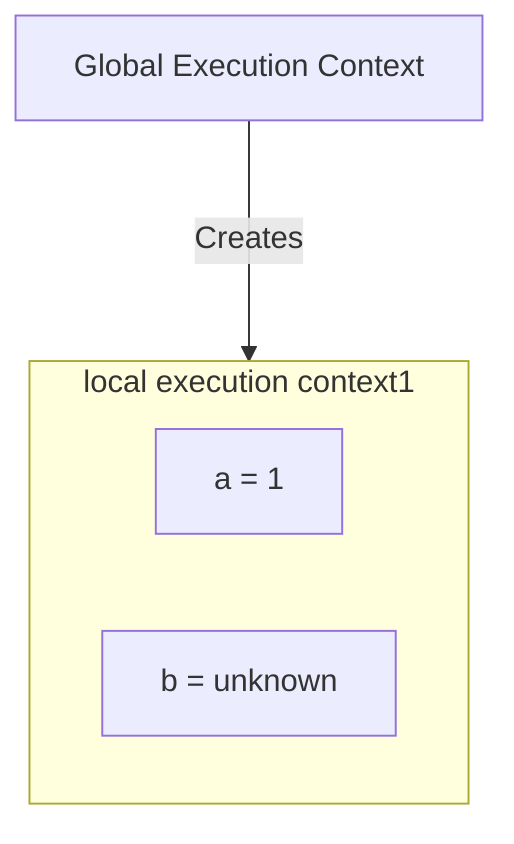

---
layout: two-cols
---

````md magic-move {lines: true}
```ts {11-12}

const name = 'Jonas';

const first = () => {
  let a = 1;
  const b = second(7, 9);
  a = a + b;
  return a;
};

function second(x, y) {
  var c = 2;
  return c;
}

const x = first();
```
````

::right::

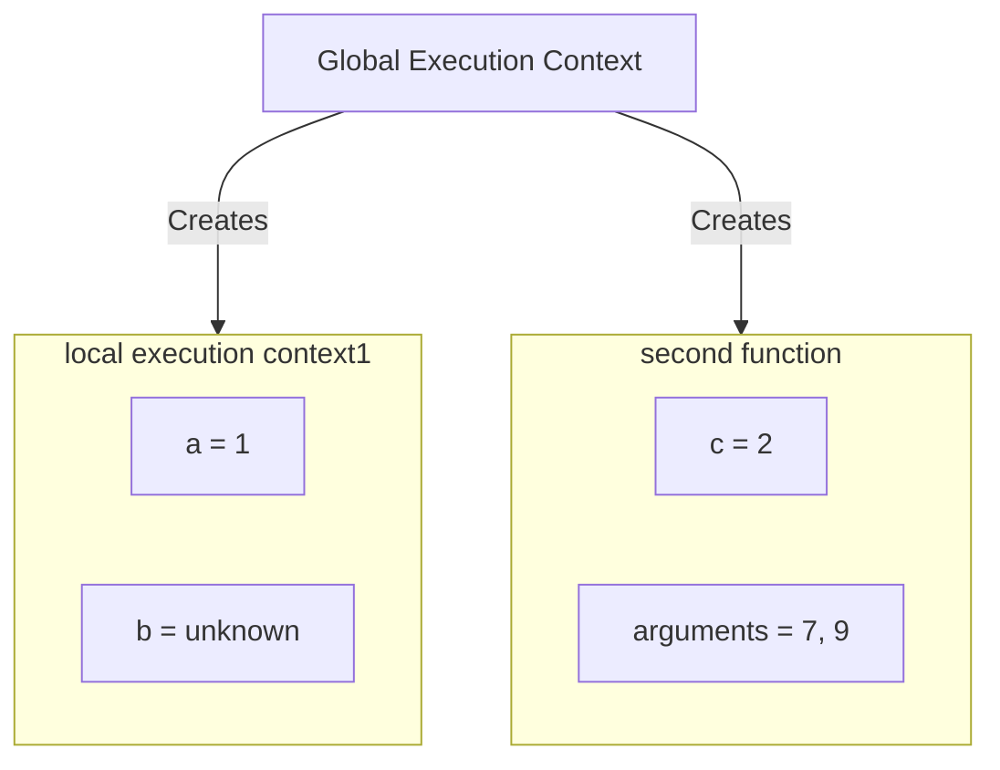

---

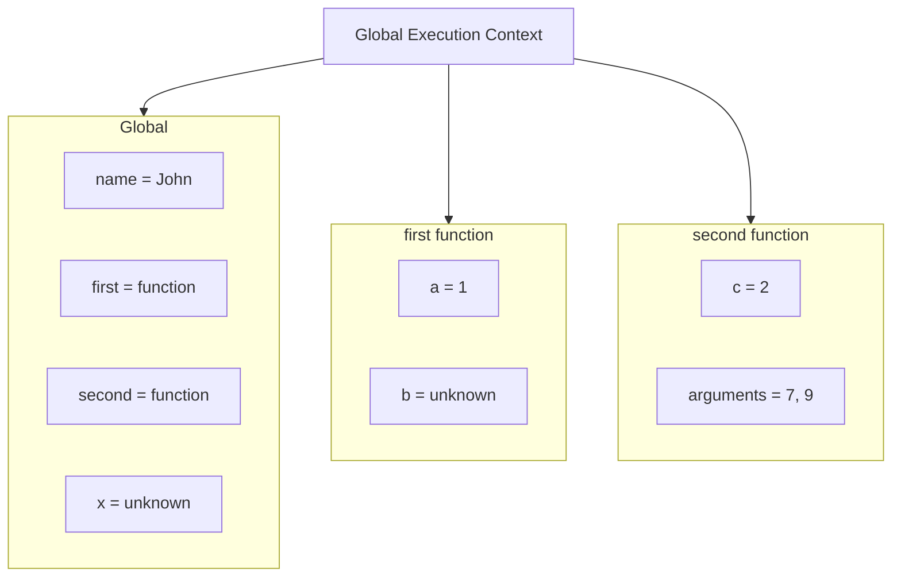

---


---


---


---


---


---


---


---


---


---


---
layout: two-cols
---

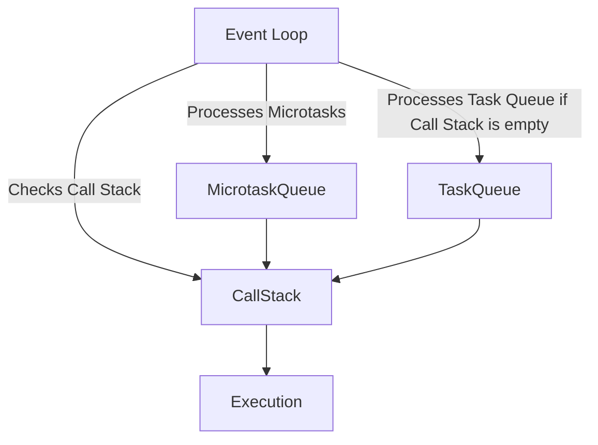

::right::

- Event Loop: Manages code execution by checking the Call Stack and processing the Microtask and Task Queues.

- Microtask Queue: Contains high-priority async tasks like Promise, then, and catch callbacks. The Event Loop always processes these before moving to the Task Queue, so they enter the Call Stack first.

- Task Queue (Callback Queue): Holds lower-priority async tasks like setTimeout, setInterval, I/O, and DOM events. These enter the Call Stack only when both the Microtask Queue and Call Stack are empty.

- Call Stack: Executes code in sequence.

- Execution: Final code execution within the Call Stack.

---
layout: two-cols
---

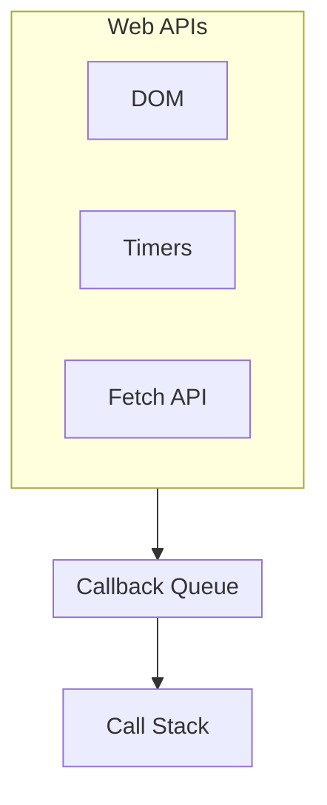

::right::

- Web APIs: Various functions are hosted here, such as DOM, Timers, and Fetch API.

- Callback Queue: Initially empty, waiting for tasks to be queued.

- Call Stack: Awaits new tasks to execute.

---
layout: two-cols
---

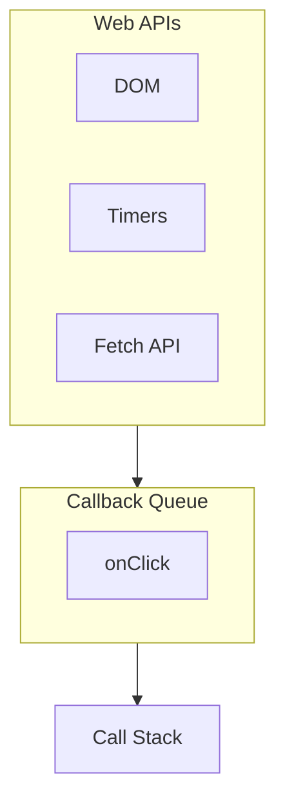

::right::

- DOM Event (click): A click event occurs in the DOM.

- Callback to Callback Queue: The relevant callback function is placed in the Callback Queue.

- Event Loop Check: The Event Loop checks if the Call Stack is empty and prepares to move items from the Callback Queue to the Call Stack.

---
layout: two-cols
---

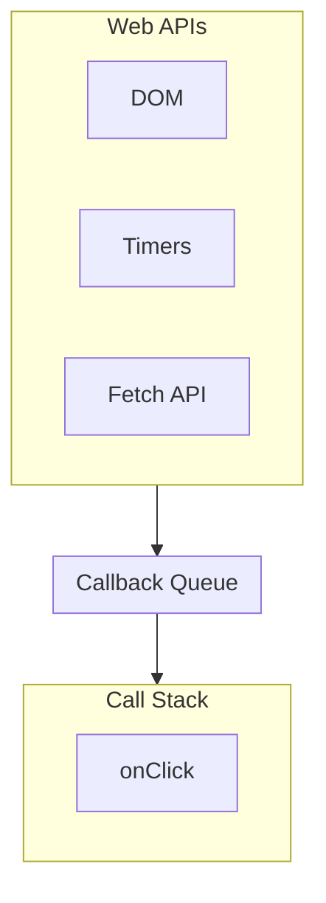

::right::

- onClick Callback to Call Stack: The onClick callback moves to the Call Stack and starts executing.

- Callback Queue is Empty: The Callback Queue is now cleared of tasks.

- Call Stack Execution: The Call Stack processes the callback until it finishes and removes it from the stack.

---
layout: two-cols
---


::right::

- All Tasks Complete: The Call Stack is now empty after execution, indicating all tasks have been completed.
