---

# Overview of the slides

<br>
🌐 An High-Level Overview of Javascript
<br>
<br>

🚀 The JavaScript Engine and Runtime
<br>
<br>

🧠 Execution Contexts and the Call Stack
<br>
<br>

🔗 Scope and The Scope Chain
<br>
<br>

🔄 Variable Environment
<br>
<br>

⚖️ Dynamic vs Static Memory
<br>

<!--
You can have `style` tag in markdown to override the style for the current page.
Learn more: https://sli.dev/features/slide-scope-style
-->

<style>
h1 {
  background-color: #F0C808;
  background-image: linear-gradient(45deg, #F7DF1E 10%, #D4A017 20%);
  background-size: 100%;
  -webkit-background-clip: text;
  -moz-background-clip: text;
  -webkit-text-fill-color: transparent;
  -moz-text-fill-color: transparent;
}
</style>

<!--
Here is another comment.
-->

---


---

<div class="scrollable-container">

|                                                    |                             |
| -------------------------------------------------- | --------------------------- |
| <kbd>High-level </kbd>                | რესურსების მართვა ჩვენ არ გვჭირდება, Javascriopt-ის ძრავა ამას ავტომატურად აკეთებს    |
| <kbd>Garbage-collected</kbd> | მეხსიერების მართვა. ალგორითმი JavaScript ძრავაში, რომელიც ავტომატურად შლის ძველ და გამოუყენებელ ობიექტებს |
| <kbd>Interpreted or just-in-time compiled</kbd> | კოდი კომპილირდება შესრულებისას, რაც უზრუნველყოფს უფრო სწრაფ შესრულებას. |
| <kbd>Multi-paradigm</kbd>  | პროცედურული პროგრამირება, ობიექტზე ორიენტირებული პროგრამირება, ფუნქციური პროგრამირება. შეგვიძლია გამოვიყენოთ ნებისმიერი პარადიგმა, რომელიც გვსურს |
| <kbd>Prototype-based object-oriented</kbd> | ``` const arr = [1,2,3] ``` ```array.push(4)``` ```->``` ``` Array.prototype.push```|
| <kbd>First-class functions</kbd>                                    | ფუნქციები განიხილება როგორც "ცვლადები". შეგვიძლია გამოვიყენოთ ისინი სხვა ფუნქციებში ან დავაბრუნოთ სხვა ფუნქციებიდან. ```overlay.addEventListener("click", someFunctionName)```|
| <kbd>Dynamic Memory</kbd> | JavaScript-ში ცვლადებს არ ვანიჭებთ მონაცემთა ტიპებს.მეხსიერება გამოიყოფა შესრულების დროს, რაც უზრუნველყოფს უფრო მოქნილ და ეფექტურ მეხსიერების მართვას. |
| <kbd>Static Memory</kbd> |	მეხსიერება წინასწარ არის განსაზღვრული და მისი ზომა არ იცვლება პროგრამის შესრულებისას|
| <kbd>Single-threaded</kbd>  | როგორ უმკლავდება JavaScript ძრავა მრავალ ამოცანას ერთდროულად? 👉 JavaScript მუშაობს ერთი single thread-ით, ამიტომ ერთდროულად მხოლოდ ერთ ამოცანას ასრულებს |
| <kbd>Non-blocking event loop</kbd>                                    | ```Event Loop``` არის უწყვეტი პროცესი, რომელიც მართავს კოდის შესრულებას, ახორციელებს call stack-ის, microtask queue-ის და callback queue-ის მართვას, რათა უზრუნველყოს ასინქრონული ოპერაციების ეფექტური და არაბლოკირებული შესრულება JavaScript-ში|

</div>

<style>
.scrollable-container {
  max-height: 400px; /* განუსაზღვრეთ სიმაღლე */
  overflow-y: auto; /* ვერტიკალური სქროლის გააქტიურება */
}

kbd {
  font-size: 10px;
  display: inline-block;
  margin-bottom: 2px;
  margin: 0px;
}

td {
  font-size: 12px; 
  padding: 8.5px;
  margin: 0px;
}

</style>

---


---


---
layout: two-cols
---

```ts 

const name = 'Jonas';

const first = () => {
  let a = 1;
  const b = second(7, 9);
  a = a + b;
  return a;
};

function second(x, y) {
  var c = 2;
  return c;
}

const x = first();
```

::right::

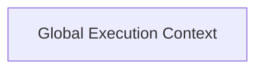

---
layout: two-cols
---

````md magic-move {lines: true}
```ts {1}

const name = 'Jonas';

const first = () => {
  let a = 1;
  const b = second(7, 9);
  a = a + b;
  return a;
};

function second(x, y) {
  var c = 2;
  return c;
}

const x = first();
```
````

::right::

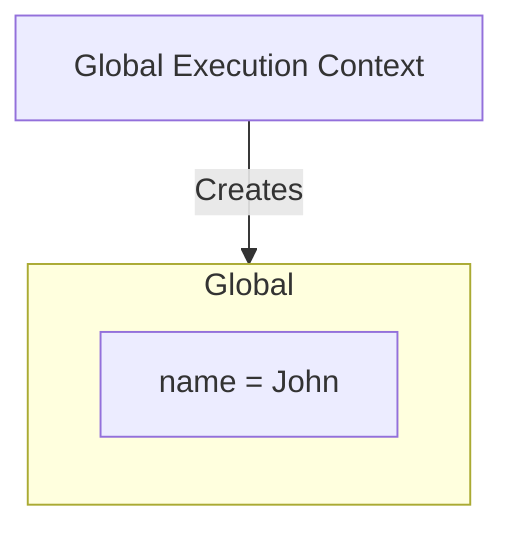

---
layout: two-cols
---

````md magic-move {lines: true}
```ts {3}

const name = 'Jonas';

const first = () => {
  let a = 1;
  const b = second(7, 9);
  a = a + b;
  return a;
};

function second(x, y) {
  var c = 2;
  return c;
}

const x = first();
```
````

::right::

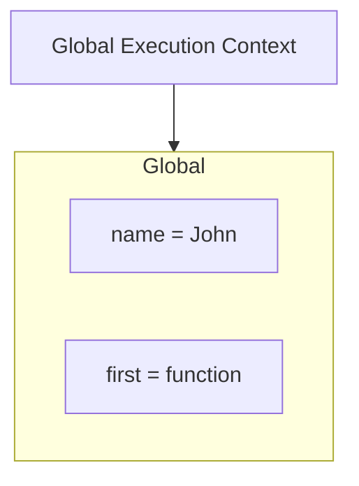

---
layout: two-cols
---

````md magic-move {lines: true}
```ts {10}

const name = 'Jonas';

const first = () => {
  let a = 1;
  const b = second(7, 9);
  a = a + b;
  return a;
};

function second(x, y) {
  var c = 2;
  return c;
}

const x = first();
```
````

::right::

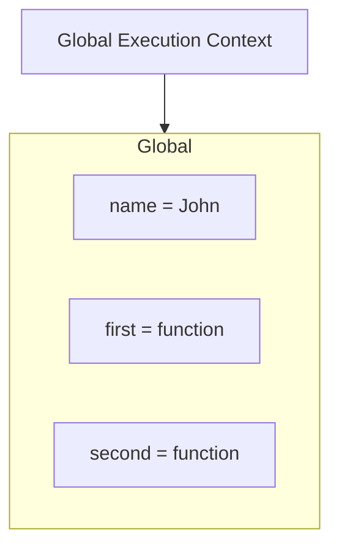

---
layout: two-cols
---

````md magic-move {lines: true}
```ts {15}

const name = 'Jonas';

const first = () => {
  let a = 1;
  const b = second(7, 9);
  a = a + b;
  return a;
};

function second(x, y) {
  var c = 2;
  return c;
}

const x = first();
```
````

::right::

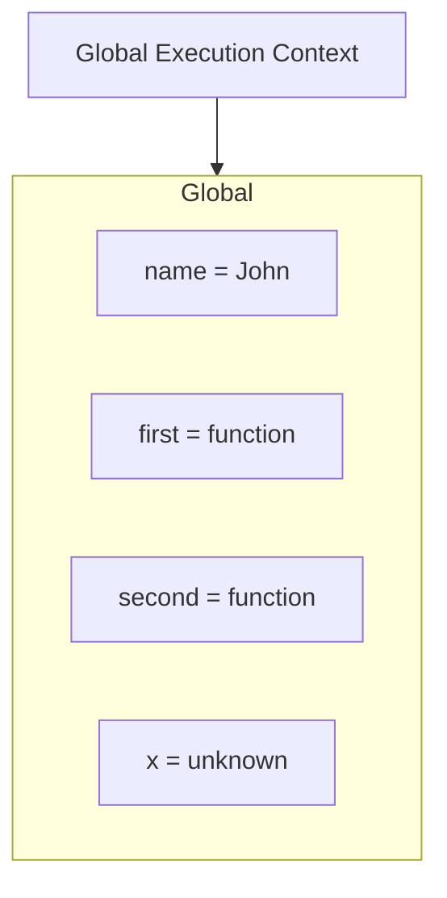

---
layout: two-cols
---

````md magic-move {lines: true}
```ts {4-7}

const name = 'Jonas';

const first = () => {
  let a = 1;
  const b = second(7, 9);
  a = a + b;
  return a;
};

function second(x, y) {
  var c = 2;
  return c;
}

const x = first();
```
````

::right::

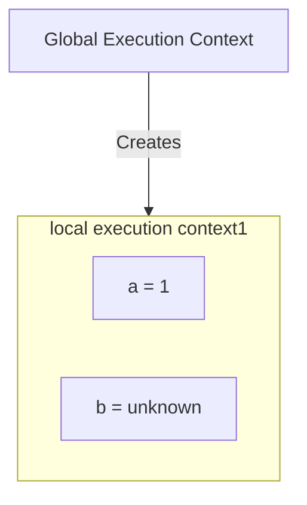

---
layout: two-cols
---

````md magic-move {lines: true}
```ts {11-12}

const name = 'Jonas';

const first = () => {
  let a = 1;
  const b = second(7, 9);
  a = a + b;
  return a;
};

function second(x, y) {
  var c = 2;
  return c;
}

const x = first();
```
````

::right::

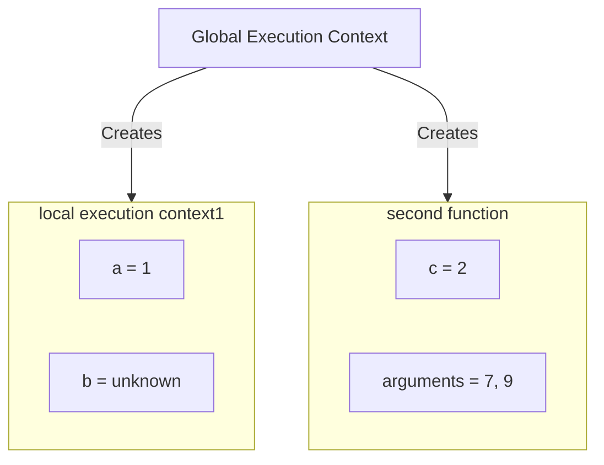

---

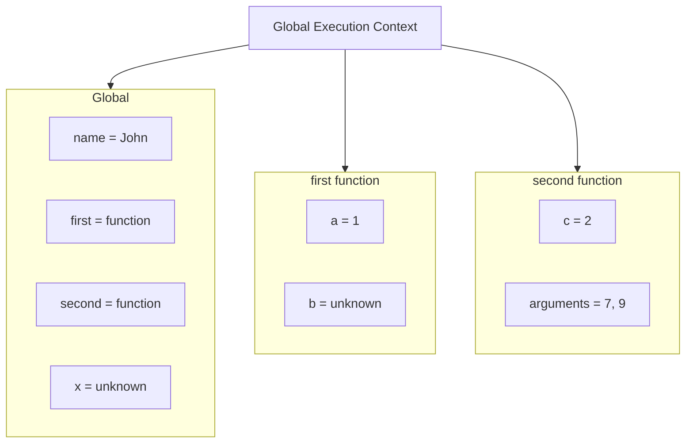

---


---


---


---


---


---


---


---


---


---


---
layout: two-cols
---

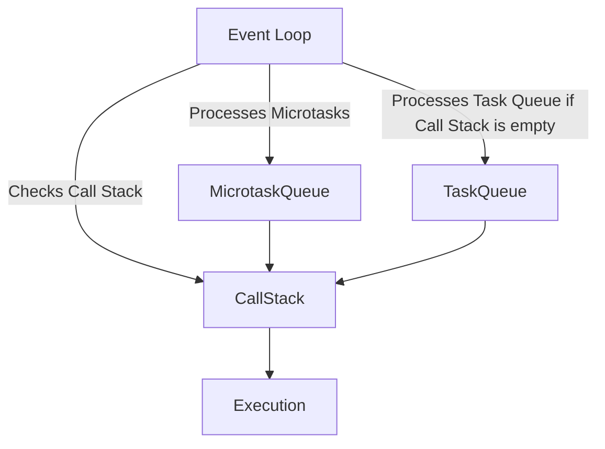

::right::

- Event Loop: მართავს კოდის შესრულებას, ამოწმებს Call Stack-ს და ამუშავებს Microtask Queue-სა და Task Queue-ს.

- Microtask Queue: შეიცავს მაღალი პრიორიტეტით ასინქრონულ ოპერაციებს (Promises და სხვ..). აქ მოთავსებული ფუნქციები გადადის Call Stack-ში პირველი ვიდრე Task Queue-ში მოთავსებული ფუნქციები

- Task Queue: შეიცავს სხვა ტიპის ასინქრონულ ოპერაციებს (setTimeout, I/O). აქ მოთავსებული ფუნქციები გადადის Call Stack-ში მხოლოდ მას შემდეგ, რაც Microtask Queue  და Call Stack ცარიელია.

- Call Stack: ასრულებს კოდს თანმიმდევრულად.

- Execution: კოდის საბოლოო შესრულება Call Stack-ში

---
layout: two-cols
---

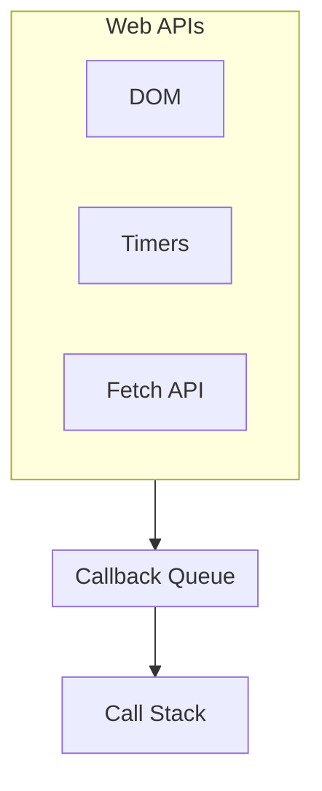

::right::

- Web APIs-ში მოთავსებულია სხვადასხვა ფუნქციები

- როგორიცაა DOM, Timers და Fetch API

- Callback Queue ცარიელია

- Call Stack ელოდება ახალ ამოცანებს.

---
layout: two-cols
---

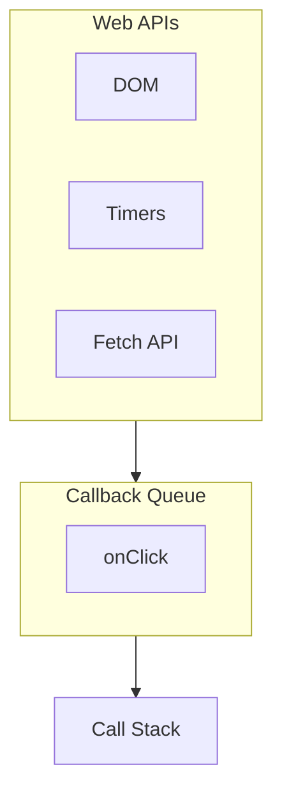

::right::

- ხდება DOM მოვლენა (click)  

- შესაბამისი callback გადადის Callback Queue-ში.

- Event Loop ამოწმებს, რომ Call Stack ცარიელია და მზად არის Callback Queue-დან ელემენტების გადასატანად call stack ში.

---
layout: two-cols
---

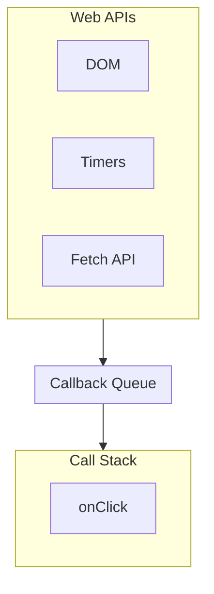

::right::

- onClick callback გადადის Call Stack-ში და იწყებს შესრულებას

- Callback Queue დაცარიელდა 

- Call Stack მუშაობს, სანამ ფუნქცია არ დასრულდება და სტეკიდან ამოიშლება.

---
layout: two-cols
---


::right::

- შესრულდა ყველაფერი და callstack იც გაცარიელდა
